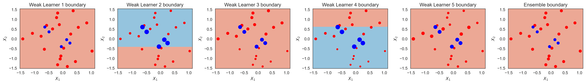
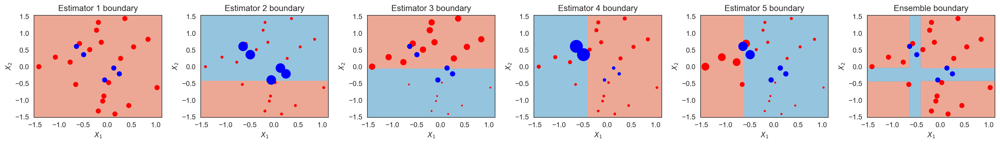
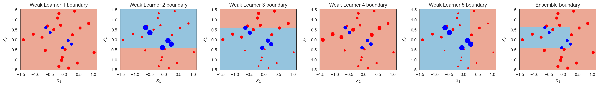

# Cumulative Cost Sensitive Boosting (AdaCC)

This repo contains AdaCC method. AdaCC method is a dynamic cost-sensitive method which estimates the misclassification costs based on the behavior of the partial ensemble to minimize the balanced error.

It is implemented in python 3.8.
The required libraries of this repo are the following:

* joblib==0.14.1
* pandas==1.0.1
* mlxtend==0.17.2
* scipy==1.4.1
* imbalanced_learn==0.6.2
* numpy==1.13.3
* matplotlib==2.1.1
* imblearn==0.0
* scikit_learn==0.22.2.post1

The following example showcases how the weighting strategy of AdaCC differs from AdaBoost.

<figure>
  
</figure>

<figure>
  
</figure>

<figure>
  
</figure>

